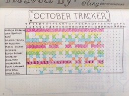

Habit Tracker
============

**This:**



**for him:**


## How to install
    gem install habittracker

## How to use it

```bash
>./ht add "Play Tennis" "Study German" "Do 20 pushups" "Miracle morning"
>./ht do
What did you do?
1. Play Tennis
2. Study German
3. Do 20 pushup
4. Miracle morning
?  1
When did you "Play Tennis" the last time?
1. Today
2. Yesteday
3. Fri 13
4. Thu 12
5. Wed 11
6. Tue 10
?  1

./ht report 

+-----+-------------+--------------+--------------+-----------------+
|                              January                              |
+-----+-------------+--------------+--------------+-----------------+
| Day | Play Tennis | Study German | Do 20 pushup | Miracle morning |
+-----+-------------+--------------+--------------+-----------------+
| 01  |             |              |              |        X        |
| 02  |             |              |              |        X        |
| 03  |             |              |              |        X        |
| 04  |             |              |      X       |        X        |
| 05  |             |              |              |        X        |
| 06  |             |              |      X       |        X        |
| 07  |      X      |              |              |        X        |
| 08  |      X      |      X       |      X       |        X        |
| 09  |             |              |      X       |        X        |
| 10  |      X      |              |      X       |        X        |
| 11  |             |      X       |              |        X        |
| 12  |             |              |              |        X        |
| 13  |             |      X       |      X       |        X        |
| 14  |      X      |              |      X       |        X        |
| 15  |             |              |              |        X        |
| 16  |             |      X       |      X       |        X        |
| 17  |             |              |              |        X        |
| 18  |             |              |      X       |        X        |
| 19  |             |      X       |              |        X        |
| 20  |             |              |              |        X        |
| 21  |             |      X       |      X       |        X        |
| 22  |             |              |              |        X        |
| 23  |             |      X       |              |        X        |
| 24  |      X      |              |              |        X        |
| 25  |             |              |              |        X        |
| 26  |             |              |              |        X        |
| 27  |             |      X       |              |        X        |
| 28  |      X      |              |              |        X        |
| 29  |             |              |              |        X        |
| 30  |             |              |              |        X        |
| 31  |             |              |              |        X        |
+-----+-------------+--------------+--------------+-----------------+
```
  NAME:

    ht

  DESCRIPTION:

    Track your monthly habits

  COMMANDS:

    add    Add one or more habits to the list
    do     Record your activities
    habits Print the list of current habits
    help   Display global or [command] help documentation
    report Print the current month's activities
    rm     Remove one or more habits from the list

  GLOBAL OPTIONS:

    -h, --help
        Display help documentation

    -v, --version
        Display version information

    -t, --trace
        Display backtrace when an error occurs


